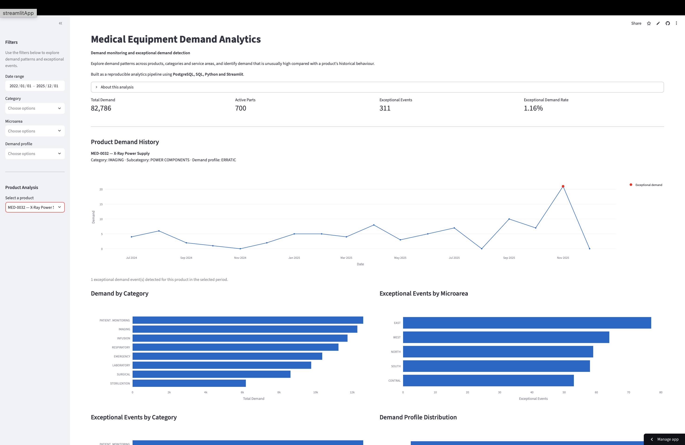
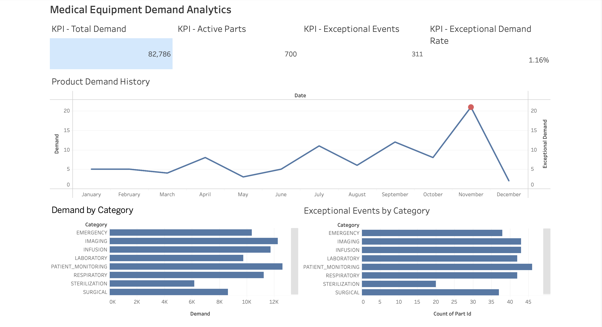

# Medical Equipment Demand Analytics

> **Portfolio project based on a real-world analytical problem, rebuilt with synthetic data for confidentiality.**

## Overview

This project explores an analytical problem I encountered during an internship project in the agricultural equipment industry: **identifying exceptional demand in spare-parts data**.

The original business project involved confidential company data. To create a publicly shareable portfolio project, the data, business-specific parameters and implementation were replaced with a fully synthetic dataset and a modified detection approach.

The project was developed as an end-to-end analytics workflow combining SQL, PostgreSQL, Python, statistical analysis, validation and interactive BI dashboards.

> **Important:** All data in this repository is synthetic and generated specifically for this portfolio project. No real company, customer, transaction or confidential business data is included.

## Business Problem

Spare parts can have very different demand patterns.

Some products are requested consistently, while others have intermittent, lumpy or highly variable demand.

This creates a practical analytics question:

> **How can unusually high demand be identified without applying the same threshold to every product?**

The project focuses on detecting demand observations that are unusually high compared with a product's own historical behaviour.

## What the Project Does

The pipeline:

- generates a synthetic spare-parts demand dataset;
- loads the data into PostgreSQL;
- performs SQL-based analysis and data-quality checks;
- analyses product-level demand patterns in Python;
- classifies products by demand behaviour;
- detects exceptional demand using profile-specific historical baselines;
- tracks product reactivation as a separate signal;
- validates the detection approach against synthetic ground-truth events;
- creates an analytical output dataset;
- presents the results in interactive Streamlit and Tableau dashboards.

## Key Results

The final dataset contains:

| Metric | Value |
|---|---:|
| Products | 700 |
| Monthly observations | 26,814 |
| Period | Jan 2022 – Dec 2025 |
| Total demand | 82,786 |
| Detected exceptional events | 311 |
| Exceptional demand rate | 1.16% |
| Reactivation signals | 483 |

The detection approach was evaluated against 496 synthetic target events, excluding `NEW_PRODUCT` lifecycle events from the main quantity-outlier evaluation.

| Metric | Result |
|---|---:|
| Precision | 0.486 |
| Recall | 0.304 |
| F1-score | 0.374 |

These metrics are presented as validation results for the synthetic dataset rather than as estimates of real-world production performance.

The detection metrics are discussed in more detail in the **Validation & Limitations** section below, including the precision–recall trade-off and the limitations of evaluating the approach on synthetic data.

## Demand Profiles

Demand is not treated as homogeneous across products.

Each product is assigned a demand profile based on how frequently it is requested and how much its demand varies over time.

### Stable

Demand is relatively consistent over time.

### Intermittent

Demand occurs with frequent periods of zero demand.

### Lumpy

Demand is infrequent and varies considerably in size.

### Erratic

Demand is relatively frequent but highly variable.

Because these profiles behave differently, exceptional demand is identified using profile-specific historical baselines rather than one common threshold.

## Demand Profiling & Upper-Bound Methodology

Exceptional demand is not evaluated using one global threshold. Different products can have very different demand behaviours: some are requested almost every month, while others have long periods with no demand followed by occasional large orders.

To account for this, the detection pipeline first classifies each product's demand profile and then applies a profile-specific historical threshold.

### ADI and CV²

Two statistics are used to describe demand behaviour.

**Average Demand Interval (ADI)** measures how frequently positive demand occurs:

$$
ADI = \frac{T}{N}
$$

where:

- $T$ is the number of historical periods;
- $N$ is the number of periods with positive demand.

A higher ADI indicates more intermittent demand.

**Squared Coefficient of Variation (CV²)** measures the variability of positive demand quantities:

$$
CV^2 = \left(\frac{\sigma}{\mu}\right)^2
$$

where:

- $\mu$ is the mean positive demand;
- $\sigma$ is the standard deviation of positive demand.

The implementation calculates CV² using only positive demand observations, while zero-demand periods contribute to ADI and coverage. This reflects the distinction between demand frequency and demand-size variability.

### Demand Profile Classification

The project uses the commonly referenced ADI/CV² classification scheme with cut-offs of **1.32 for ADI** and **0.49 for CV²**.

| Profile | ADI | CV² | Interpretation |
|---|---:|---:|---|
| **Stable** | < 1.32 | < 0.49 | Frequent and relatively consistent demand |
| **Erratic** | < 1.32 | ≥ 0.49 | Frequent demand with high quantity variability |
| **Intermittent** | ≥ 1.32 | < 0.49 | Infrequent demand with relatively consistent positive quantities |
| **Lumpy** | ≥ 1.32 | ≥ 0.49 | Infrequent and highly variable demand |

The ADI/CV² framework is based on established research on intermittent demand and is widely used to distinguish different demand patterns. See the references below.

### Historical Baseline

After assigning a demand profile, the algorithm calculates a product-specific historical baseline.

The baseline uses:

- up to the previous **12 months** of demand;
- a minimum of **6 months** of history;
- the current observation is excluded from the baseline using a one-period shift.

For intermittent and lumpy products, zero-demand periods are expected behaviour and therefore the baseline statistics are calculated from previous positive-demand observations.

This prevents the current observation from influencing its own threshold and reduces data leakage during anomaly detection.

### Profile-Specific Upper Bounds

The upper bound is deliberately different for different demand profiles.

#### Stable demand

Stable demand is modelled using a Poisson-style threshold:

$$
UpperBound = \mu_{12} + 3.5\sqrt{\mu_{12}}
$$

where $\mu_{12}$ is the mean demand over the previous 12 months.

The square-root term reflects the variance structure of a Poisson distribution. The multiplier **3.5** is a manually selected safety coefficient used to create a relatively conservative threshold for stable demand.

For example, if historical mean demand is 4:

$$
UpperBound = 4 + 3.5\sqrt{4} = 11
$$

A current demand substantially above this level becomes a candidate for exceptional demand.

#### Erratic demand

Erratic demand has relatively frequent observations but high variation in quantity. A robust IQR-based threshold is therefore used:

$$
UpperBound = Q3 + 3.0 \times IQR
$$

where:

$$
IQR = Q3 - Q1
$$

The IQR approach is less sensitive to individual extreme observations than a mean-and-standard-deviation threshold.

#### Intermittent demand

For intermittent demand, the threshold also depends on demand coverage:

$$
Coverage =
\frac{\text{number of positive-demand periods}}
{\text{number of historical periods}}
$$

Three cases are used:

| Coverage | Upper-bound rule |
|---|---|
| < 20% | Median × 2.5 |
| 20%–40% | max(Median × 3.0, Q3) |
| ≥ 40% | Q3 + 2.5 × IQR |

The logic becomes more conservative as the demand series becomes less sparse.

#### Lumpy demand

Lumpy demand follows the same coverage-based structure, but uses a wider IQR multiplier in the less-sparse case because lumpy demand combines intermittency with greater quantity variability:

| Coverage | Upper-bound rule |
|---|---|
| < 20% | Median × 2.5 |
| 20%–40% | max(Median × 3.0, Q3) |
| ≥ 40% | Q3 + 3.0 × IQR |

### Why use different thresholds?

A single global threshold would treat very different products as if they had the same normal demand behaviour.

For example, a demand of 15 units could be:

- unusually high for a product that normally receives 3–4 units per month;
- completely normal for a product that regularly receives 12–15 units;
- difficult to interpret for a lumpy product whose positive orders occur only a few times per year.

The profile-specific approach therefore makes the detection logic relative to each product's own historical behaviour.

### Parameter Choice

The coefficients in this project are **heuristic parameters**, not parameters learned or optimized from real company data.

They were selected to demonstrate a transparent and reproducible analytical approach:

| Parameter | Value | Purpose |
|---|---:|---|
| ADI threshold | 1.32 | Demand-frequency classification |
| CV² threshold | 0.49 | Demand-variability classification |
| Historical window | 12 months | Recent product behaviour |
| Minimum history | 6 months | Avoid unstable early thresholds |
| Stable Poisson multiplier | 3.5 | Conservative upper bound |
| Erratic IQR multiplier | 3.0 | Robust threshold for variable demand |
| Intermittent IQR multiplier | 2.5 | Threshold for less-sparse intermittent demand |
| Lumpy IQR multiplier | 3.0 | Wider threshold for highly variable demand |
| Very sparse coverage | 20% | Switch to median-based threshold |
| Sparse coverage | 40% | Switch between sparse and IQR-based rules |

These parameters should be recalibrated using historical labelled data and business costs before applying a similar approach in a production environment.

### References

The ADI/CV² classification is based on established research into intermittent demand:

- Syntetos, A. A., & Boylan, J. E. (2005). *The accuracy of intermittent demand estimates*. International Journal of Forecasting, 21(2), 303–314.
- Syntetos, A. A., & Boylan, J. E. (2001). *On the bias of intermittent demand estimates*. International Journal of Production Economics, 71(1–3), 457–466.
- frePPLe. *Demand classification: why forecastability matters*. Medium — a practical explanation of ADI/CV² demand classification.

The academic literature provides the theoretical background for intermittent-demand analysis, while the implementation-specific upper-bound coefficients in this project are custom heuristics developed for the synthetic portfolio dataset.

## Exceptional Demand Detection

The detection workflow is based on each product's historical behaviour.

For each product:

1. Historical demand characteristics are calculated.
2. The product is assigned a demand profile.
3. A profile-specific historical baseline is calculated.
4. Current demand is compared with the expected historical level.
5. Observations that exceed the relevant threshold are flagged as exceptional demand.
6. An anomaly score is calculated to indicate how unusual the observation is.
7. Product reactivation after a prolonged period of zero demand is tracked separately as an additional signal.

The objective is to distinguish genuinely unusual demand from normal variation that is expected for a particular product.

## Data Pipeline

```mermaid
flowchart TD
    A[Synthetic Data Generation] --> B[CSV]
    B --> C[PostgreSQL]
    C --> D[SQL Analysis]
    C --> E[Data Quality Checks]
    D --> F[Python Demand Analysis]
    E --> F
    F --> G[Exceptional Demand Detection]
    G --> H[analytics_demand_output]
    H --> I[Streamlit Dashboard]
    H --> J[Tableau Dashboard]

## Data Pipeline

```mermaid
flowchart TD
    A[Synthetic Data Generation] --> B[CSV]
    B --> C[PostgreSQL]
    C --> D[SQL Analysis]
    C --> E[Data Quality Checks]
    D --> F[Python Demand Analysis]
    E --> F
    F --> G[Exceptional Demand Detection]
    G --> H[analytics_demand_output]
    H --> I[Streamlit Dashboard]
    H --> J[Tableau Dashboard]
```

## Database

The PostgreSQL database contains the following main tables.

### `products`

Product master data:

- `part_id`
- `description`
- `category`
- `subcategory`

### `sales`

Monthly demand observations:

- `part_id`
- `date`
- `demand`
- `microarea`

### `ground_truth`

Synthetic event labels used only for validation:

- `part_id`
- `date`
- `event_type`

### `detection_results`

Output generated by the Python detection pipeline.

### `analytics_demand_output`

Final analytical dataset combining product information with demand and detection results.

The Streamlit and Tableau dashboards are built from this analytical output.

---

## SQL Analysis

The SQL layer includes:

- joins between transactional and product data;
- monthly demand trends;
- demand by category;
- demand by microarea;
- category × microarea analysis;
- top products by demand;
- zero-demand analysis;
- demand variability;
- seasonality analysis;
- lifecycle analysis;
- event impact analysis;
- exceptional demand activity.

SQL is also used for data-quality checks before the analytical output is created.

---

## Data Quality

The pipeline includes checks for:

- expected row counts;
- unique product identifiers;
- date coverage;
- missing values;
- invalid demand values;
- duplicate observations;
- valid category and microarea values;
- consistency between generated data and ground truth.

The detection output is also checked after loading into PostgreSQL to ensure that the CSV and database row counts match.

---

## Validation & Limitations

The detection pipeline was validated against synthetic ground-truth events generated together with the dataset.

`NEW_PRODUCT` events are excluded from the main quantity-outlier evaluation because a new product does not have an established historical baseline. Its initial demand is therefore a lifecycle event rather than an unexpected increase relative to previous demand.

The main validation set contains **496 target events**.

### Validation Results

| Metric | Result |
|---|---:|
| Precision | 0.486 |
| Recall | 0.304 |
| F1-score | 0.374 |

These results should be interpreted as validation of the analytical pipeline on a controlled synthetic dataset, **not as estimates of real-world production performance**.

The detector identified 311 exceptional demand observations. Of these, 151 matched target ground-truth events, while 160 were false positives under the synthetic validation rules.

### Interpreting the Results

The results demonstrate a clear precision–recall trade-off.

A lower anomaly threshold produces more alerts and therefore increases the opportunity to detect exceptional events, but it also produces more false positives. A higher threshold reduces false positives but misses more target events.

For this portfolio project, the detector is therefore positioned as a **screening and prioritization tool**, rather than a fully automated decision system.

In a real business environment, the appropriate threshold would depend on the relative cost of:

- missing an exceptional demand event;
- investigating a false alert;
- delaying a replenishment or planning decision;
- and the operational capacity available for manual review.

### Why the Results Are Limited

The dataset is fully synthetic. This provides important benefits for a portfolio project:

- the data can be shared publicly;
- the generation process is reproducible;
- exceptional events have known labels;
- the complete analytical pipeline can be demonstrated without exposing confidential information.

However, synthetic data also limits how far the validation results can be generalized.

The main limitations are:

1. **Synthetic demand behaviour**

   The demand patterns were generated using predefined statistical rules. Real spare-parts demand can contain more complex dependencies and irregularities.

2. **Synthetic ground truth**

   The ground-truth events are generated by the same synthetic process as the demand data. They are therefore controlled labels rather than independent expert annotations from real business data.

3. **Heuristic parameters**

   The upper-bound coefficients were selected manually for transparency and reproducibility. They were not optimized using a large real-world labelled dataset.

4. **Limited business context**

   The dataset does not model all factors that can influence spare-parts demand, such as installed equipment population, machine age, maintenance schedules, lead times, stock availability, substitutions, customer-specific behaviour or supply constraints.

5. **Limited event taxonomy**

   The synthetic dataset contains a predefined set of exceptional events. Real operational data may contain additional causes of unusual demand that are not represented here.

6. **No production cost optimization**

   The threshold was not optimized against an explicit business cost function. In production, false positives and false negatives would have different operational costs.

### Intended Use

The primary objective of this project is to demonstrate an end-to-end analytical workflow:

**SQL → data quality → demand profiling → historical baselines → exceptional-demand detection → validation → BI dashboards**

The validation results should therefore be read as evidence that the pipeline is testable and reproducible on controlled data, rather than as evidence that the detection logic is ready for direct production deployment.

A production implementation would require historical real-world data, independently labelled exceptional events, domain validation of event definitions, parameter calibration and monitoring of detection quality over time.

---

## BI Dashboards

The analytical output is presented through two BI dashboards built from the same dataset:

- **Streamlit** — interactive Python-based dashboard;
- **Tableau Public** — interactive BI dashboard.

### Streamlit

[🚀 Open Interactive Dashboard](https://medical-equipment-demand-analytics-ead9qjzcceccpdktotkqth.streamlit.app)

The Streamlit dashboard provides:

- Total Demand;
- Active Parts;
- Exceptional Events;
- Exceptional Demand Rate;
- Product Demand History;
- exceptional demand observations highlighted in red;
- Demand by Category;
- Exceptional Events by Microarea;
- Exceptional Events by Category;
- Demand Profile Distribution;
- Exceptional Demand Explorer.

### Tableau

[📊 Open Tableau Dashboard](https://public.tableau.com/views/MedicalEquipmentDemandAnalytics/MedicalEquipmentDemandAnalytics?:language=en-US&publish=yes)

The Tableau dashboard presents the same analytical output in a second BI environment and includes:

- Total Demand;
- Active Parts;
- Exceptional Events;
- Exceptional Demand Rate;
- Product Demand History;
- exceptional demand observations highlighted in red;
- Demand by Category;
- Exceptional Events by Microarea;
- Exceptional Events by Category;
- Demand Profile Distribution.

Both dashboards use the same analytical dataset, allowing the same results to be explored through different BI tools.

---

## Dashboard Preview

### Streamlit



[🚀 Open Interactive Streamlit Dashboard](https://medical-equipment-demand-analytics-ead9qjzcceccpdktotkqth.streamlit.app)

### Tableau



[📊 Open Interactive Tableau Dashboard](https://public.tableau.com/views/MedicalEquipmentDemandAnalytics/MedicalEquipmentDemandAnalytics?:language=en-US&publish=yes)

---

## Project Structure

```text
medical-equipment-demand-analytics/
│
├── README.md
├── requirements.txt
├── .gitignore
├── generate_data.py
│
├── data/
│   ├── dashboard/
│   │   └── analytics_demand_output.csv
│   └── sample/
│
├── docs/
│   └── images/
│       ├── dashboard_streamlit.png
│       └── dashboard_tableau.png
│
├── sql/
│   ├── create_tables.sql
│   ├── load_data.sql
│   ├── data_quality_checks.sql
│   ├── analysis_queries.sql
│   └── create_analysis_output.sql
│
├── src/
│   ├── demand_analysis.py
│   ├── outlier_detection.py
│   ├── validate_detection.py
│   └── load_detection_results.py
│
├── dashboard/
│   └── app.py
│
└── tests/
    ├── test_data_quality.py
    └── test_outlier_detection.py

## Installation

### Requirements

- Python 3.10+
- PostgreSQL
- Git

### Install Python dependencies

```bash
pip install -r requirements.txt

### Configure the database

The project uses the `DB_CONNECTION_STRING` environment variable.

For a local PostgreSQL installation:

```bash
export DB_CONNECTION_STRING="postgresql+psycopg2://localhost/medical_equipment_demand"
```

---

## Running the Pipeline

### 1. Generate synthetic data

```bash
python generate_data.py
```

### 2. Create PostgreSQL tables

```bash
psql medical_equipment_demand -f sql/create_tables.sql
```

### 3. Load the data

```bash
psql medical_equipment_demand -f sql/load_data.sql
```

### 4. Run demand analysis

```bash
python src/demand_analysis.py
```

### 5. Run exceptional demand detection

```bash
python src/outlier_detection.py
```

### 6. Load detection results

```bash
python src/load_detection_results.py
```

### 7. Create the analytical output

```bash
psql medical_equipment_demand -f sql/create_analysis_output.sql
```

### 8. Run the Streamlit dashboard locally

```bash
streamlit run dashboard/app.py
```

The Tableau dashboard uses the exported analytical dataset and is published separately through Tableau Public.

---

## Testing and Validation

The project was verified using:

- automated data-quality checks;
- detection validation against synthetic ground-truth events;
- consistency checks between generated CSV files and PostgreSQL;
- row-count and date-range validation;
- automated tests using `pytest`;
- visual verification of the analytical results in both BI dashboards.

Run the tests with:

```bash
pytest
```

---

## Reproducibility

The synthetic dataset is generated using a fixed random seed.

This makes the generated data reproducible and allows the analytical pipeline and validation results to be regenerated consistently.

---

## Use of AI Assistance

ChatGPT was used as a coding and development assistant during the creation of this portfolio project, including support with Python, SQL, debugging, documentation and visualization.

The project originated from an analytical idea developed during the original internship work, while the public dataset, implementation, validation setup and dashboards were redesigned for this portfolio version.

---

## Limitations

This project uses synthetic data, so the demand patterns and event distribution do not represent a real medical equipment business.

The detection approach is an analytical demonstration rather than a production forecasting or inventory-optimization system.

Ground-truth events are generated synthetically and therefore provide a controlled validation framework rather than independent real-world labels.

---

## Technologies

- **Python** — data generation, demand analysis and exceptional demand detection
- **Pandas / NumPy** — data processing and statistical calculations
- **PostgreSQL** — data storage and SQL analytics
- **SQLAlchemy / psycopg2** — database connection
- **Streamlit** — interactive dashboard
- **Plotly** — data visualization
- **Tableau Public** — interactive BI dashboard
- **pytest** — automated testing

---

## Portfolio Context

This project demonstrates an end-to-end analytical workflow:

**SQL → PostgreSQL → Python → Data Quality → Statistical Analysis → Validation → BI Dashboards**

The focus is not only on identifying unusual observations, but also on making the resulting analysis reproducible, testable and understandable to non-technical users.